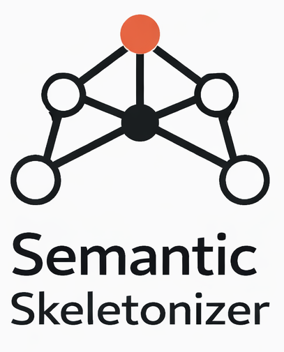

# Semantic Skeletonizer (MCP Server)

<p align="center">
  
</p>

Semantic Skeletonizer is a stateful, event-driven Model Context Protocol (MCP) server written in Rust. It generates and maintains an in-memory Topological Graph (Code Property Graph / Semantic Skeleton) of a TypeScript/React codebase.

Instead of lossy text compression, this server grants LLMs native, bidirectional sensory access to a repository by stripping out internal functional logic while preserving structural topology (types, interfaces, class structures) using `swc`. As files change, the server dynamically recalculates the Abstract Syntax Tree (AST) via a background watcher (`notify`) and pushes delta updates to connected clients over `stdio`.

## Table of Contents
- [Benefits](#benefits)
- [Features](#features)
- [Architecture Overview](#architecture-overview)
- [Setup & Installation](#setup--installation)
- [How to Use (Capabilities & Protocol)](#how-to-use-capabilities--protocol)
- [Example Prompts](#example-prompts)

---

## Benefits

- **Token-Optimized Intermediate Representation (IR):** Rather than returning a massive, overwhelming JSON AST, the server distills the AST into a highly optimized JSON object. It categorizes code perfectly into arrays of stringified `imports`, `exports`, `functions`, `interfaces`, `classes`, and `variables`.
- **Reduced Context Payload:** By stripping out internal implementations, pure cosmetic nodes, and inline comments, the payload sent to the LLM is drastically reduced by 80-90%, saving massive token costs and context window space.
- **Granular Navigation:** Instead of forcing the LLM to consume the entire global graph at once, the server exposes targeted URIs for every single file tracked, allowing the LLM to selectively ingest only what matters.
- **Always Up-To-Date:** The event-driven design means the LLM always has the latest structural context. It does not rely on static, outdated text dumps.
- **Native Memory Graph:** The graph resides entirely in-memory and updates dynamically without relying on or writing intermediate text files to the filesystem.

---

## Features
- **Gitignore-Aware Initial Sweep:** On load, the server automatically traverses the repository, respecting `.gitignore` rules via the `ignore` crate, guaranteeing the graph is fully populated before any queries arrive.
- **In-Memory Topology:** Live global mapping of the target directory without touching the filesystem.
- **Event-driven Ingestion:** Automatic AST recalculation on file saves via `tokio` and `notify`.
- **Semantic Extraction (SWC):** 
  - Preserves: Interfaces, metadata, return types, structural classes, exported types.
  - Strips: Internal implementations, loop logic, internal function states, cosmetic imports (CSS/SVG).
- **Standardized Error Handling:** Clearly flags empty workspaces or missing files via proper JSON-RPC error codes.

---

## Architecture Overview

* **`src/main.rs`:** The core entry point containing the async `tokio` event loop, JSON-RPC `stdio` message handling, and the `notify` file watcher logic.
* **SWC Visitor & Codegen Emitter:** A custom `Skeletonizer` struct implements `swc_ecma_visit::VisitMut` to clear statement bodies `stmts.clear()` from standard functions, class methods, and arrows. Afterwards, it uses the SWC Codegen `Emitter` to render these stripped nodes back into clean, readable code strings.
* **The In-Memory Graph:** Maintains a dynamic `DashMap` linking file paths to their `FileSkeleton` IR structs.
* **Event-Driven Ingestion Engine:** Listens for `Modify` events (file saves) on `.ts` or `.tsx` files to isolate the changed file, recalculate its semantic IR, and surgically mutate its node in the in-memory graph.

---

## Setup & Installation

### Prerequisites
- [Rust & Cargo](https://rustup.rs/) (edition 2024 or higher recommended)
- Node.js/TypeScript environment (for the target repositories being analyzed)

### 1. Build the Server
Clone the repository and build the binary:

```bash
cargo build --release
```

The compiled executable will be located at `target/release/semantic_skeletonizer`.

### 2. Connect to an MCP Client (e.g., Claude Desktop or custom orchestration scripts)
To use Semantic Skeletonizer, you need to add it to your MCP client's configuration file. 

For **Claude Desktop**, edit your `claude_desktop_config.json` (usually found in `~/Library/Application Support/Claude/` on macOS or `%APPDATA%\Claude\` on Windows):

```json
{
  "mcpServers": {
    "semantic-skeletonizer": {
      "command": "/absolute/path/to/semantic_skeletonizer/target/release/semantic_skeletonizer",
      "args": []
    }
  }
}
```
*Note: Make sure to replace `/absolute/path/to/...` with the actual path to the compiled binary. The server will automatically watch the current working directory from where it is spawned by the client.*

---

## How to Use (Capabilities & Protocol)

Once connected, the LLM client interacts with the server over `stdio` via standard MCP JSON-RPC messages.

### 1. The Global Skeleton Resource
The server exposes the entire in-memory skeleton as a globally accessible resource.
- **URI:** `skeleton://project/global`
- **MimeType:** `application/json`
- **Behavior:** The LLM can read this resource to understand the exact shape of your codebase without the noise of internal implementation logic.

### 2. Granular File Resources
The server dynamically exposes individual files as uniquely addressable resources.
- **URI:** `skeleton://project/file/{path/to/file.ts}`
- **Behavior:** If an LLM discovers a specific file of interest in the global view (or through standard inference), it can directly query the skeletonized IR of that isolated file, saving massive contextual memory.

### 3. Live Delta Notifications
When you edit a `.ts` or `.tsx` file in your editor and hit save, the server's background watcher detects the change, parses the new AST/IR, mutates the graph, and automatically pushes a `notifications/resources/updated` event to the LLM.

### 4. Server Tools
If the LLM needs to dive deeper into a specific piece of logic, it can invoke the following tools:

- **`list_functions`**
  - **Inputs:** `file_path` (string)
  - **Description:** Returns a clean list of all function signatures found in the specified file based on the in-memory graph.
  
- **`get_implementation`**
  - **Inputs:** `file_path` (string), `target_node` (string)
  - **Description:** Provides the complete, uncompressed, raw AST representation of the requested file when deep execution context is absolutely necessary.

---

## Example Prompts

Here are a few ways to interact with the Semantic Skeletonizer using an LLM (like Claude):

1. **"Can you map out the core architecture of this repository by reading the global skeleton?"**
   *The LLM will ingest `skeleton://project/global`, giving it an immediate aerial view of all components and how they relate without fetching all the code.*

2. **"I see the file `./src/components/Form.tsx` in the graph. Can you read that specific file's skeleton?"**
   *The LLM uses `skeleton://project/file/./src/components/Form.tsx` to read the interfaces and props exposed by that component.*

3. **"List all the functions inside `./src/utils/api.ts`."**
   *The LLM will call the `list_functions` tool using `{"file_path": "./src/utils/api.ts"}`.*

4. **"I need to understand the internal logic of `validateUser` in `auth.ts`. Extract the implementation details."**
   *The LLM will invoke the `get_implementation` tool with `{"file_path": "auth.ts", "target_node": "validateUser"}` to view the full unredacted logic.*
