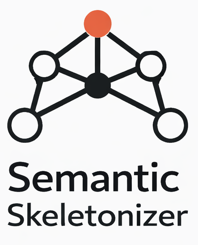

# Semantic Skeletonizer (MCP Server)

<p align="center">
  
</p>

Semantic Skeletonizer is a stateful, event-driven Model Context Protocol (MCP) server written in Rust. It generates and maintains an in-memory **semantic file graph** of a TypeScript/React codebase: per-file structural skeletons (signatures, types, classes — implementations stripped) plus **resolved import edges** between files.

> **Scope, honestly stated:** this is a dependency-edge file graph, not a Code Property Graph — there are no control-flow or data-flow edges. Nodes are files, edges are resolved imports.

Parsing is done with [oxc](https://oxc.rs). As files change, a background watcher (`notify`) re-parses only the changed files (debounced, `.gitignore`-aware) and pushes MCP resource notifications to connected clients over `stdio`.

## Table of Contents
- [Measured Token Savings](#measured-token-savings)
- [Features](#features)
- [Architecture Overview](#architecture-overview)
- [Setup & Installation](#setup--installation)
- [Resources & Notifications](#resources--notifications)
- [Tools](#tools)
- [Example Prompts](#example-prompts)

---

## Measured Token Savings

Measured against real OSS repos (shallow clones, all tracked `.ts`/`.tsx` files) by comparing original source against the per-file skeleton JSON an LLM client actually ingests. Tokens counted with `tiktoken` (`o200k_base`).

| Repo | Files | Source bytes | Skeleton bytes | Source tokens | Skeleton tokens | Token savings |
|---|---:|---:|---:|---:|---:|---:|
| [zod](https://github.com/colinhacks/zod) | 401 | 2,405,150 | 1,192,986 | 667,815 | 365,966 | **45.2%** |
| [zustand](https://github.com/pmndrs/zustand) | 34 | 265,492 | 67,572 | 66,946 | 19,882 | **70.3%** |
| [type-fest](https://github.com/sindresorhus/type-fest) | 427 | 1,127,983 | 1,303,163 | 324,485 | 387,851 | **−19.5%** |

Savings scale with how much implementation code a repo has. Implementation-heavy code (zustand) compresses ~70%; mixed code (zod) ~45%; a **types-only** repo like type-fest gets *negative* savings — types are preserved verbatim by design, so the JSON envelope only adds overhead. If your codebase is mostly type declarations, read files directly instead.

Reproduce with `scripts/bench.py <repo-dir>` — or measure your own repo before trusting any number here.

---

## Features
- **Canonical graph keys:** every node is keyed by a normalized, repo-root-relative, forward-slash path (`src/utils/api.ts`). Tool and resource inputs accept `src/x.ts`, `./src/x.ts`, or absolute paths.
- **Gitignore-aware sweep *and* watcher:** the initial sweep and the live watcher share one `.gitignore` matcher; `.git/` and `node_modules/` are always skipped.
- **Correct event handling:** create, modify, remove, and rename events all update the graph; events are debounced per path (200 ms); a file that fails to parse mid-edit keeps its previous good node.
- **Resolved import topology:** relative imports are resolved (`.ts`, `.tsx`, `/index.ts(x)`) into graph edges with a reverse-dependency index; bare specifiers are recorded as external packages.
- **Skeleton quality:** function bodies stripped; JSDoc blocks preserved; object/array literal initializers above 200 bytes elided as `/* elided: N bytes */`; type annotations always kept.
- **Protocol correctness:** version negotiation, `ping`, `resources/subscribe`/`unsubscribe` (updates are pushed only for subscribed URIs), percent-encoded resource URIs, tool failures as `result.isError`, cancellation-safe stdio reads.

---

## Architecture Overview

| Module | Responsibility |
|---|---|
| `src/main.rs` | Wiring: CLI args (`--root`), initial sweep, the `tokio` select loop over stdio + watcher events |
| `src/protocol.rs` | JSON-RPC / MCP types and request dispatch (resources, tools, subscriptions, version negotiation) |
| `src/skeleton.rs` | oxc parser + `VisitMut` skeletonizer, IR extraction, symbol table, span-sliced `get_implementation` |
| `src/graph.rs` | `AppState`: the `DashMap` graph, canonical path keys, reverse-dependency index, gitignore matcher |
| `src/resolve.rs` | Import-specifier resolution (`Resolver` trait; tsconfig `paths` is a planned extension seam) |
| `src/watcher.rs` | `notify` watcher with per-path debouncing and event coalescing |
| `src/dashboard.rs` | Optional local web dashboard (status, logs, graph inspection) |

---

## Setup & Installation

### Prerequisites
- [Rust & Cargo](https://rustup.rs/) (edition 2024)

### 1. Build the Server
```bash
cargo build --release
```
The binary lands at `target/release/semantic_skeletonizer`.

### 2. Connect to an MCP Client
For **Claude Desktop**, edit `claude_desktop_config.json` (`~/Library/Application Support/Claude/` on macOS, `%APPDATA%\Claude\` on Windows):

```json
{
  "mcpServers": {
    "semantic-skeletonizer": {
      "command": "/absolute/path/to/target/release/semantic_skeletonizer",
      "args": ["--root", "/absolute/path/to/your/project"]
    }
  }
}
```

Without `--root`, the server watches the working directory it is spawned in. The initial sweep completes before the first request is answered.

### 3. Run the tests
```bash
cargo test
```
Unit tests cover path canonicalization, import resolution, and the skeletonizer; integration tests spawn the real binary in fixture projects and drive it over stdio.

---

## Resources & Notifications

### Global graph
- **URI:** `skeleton://project/global`
- Returns a JSON object mapping every canonical file key to its skeleton, including per-file `dependencies` (resolved graph keys) and `external_deps` — a real adjacency structure. An empty graph returns `{}` plus an explanatory note (not an error).

### Per-file skeletons
- **URI:** `skeleton://project/file/{path}` (percent-encoded, e.g. `skeleton://project/file/src/utils/api.ts`)
- Each file's skeleton: `imports`, `exports`, `functions`, `classes`, `interfaces`, `variables`, `symbols`, `import_records`, `dependencies`, `external_deps`.

### Subscriptions & live updates
Clients subscribe with `resources/subscribe {uri}`. On file changes the server pushes:
- `notifications/resources/updated` — for each **subscribed** changed file URI, and for the global URI if subscribed;
- `notifications/resources/list_changed` — whenever files are added or removed (always pushed).

---

## Tools

### `list_symbols`
Every top-level symbol in a file.
```jsonc
// input
{ "file_path": "src/components/Form.tsx" }
// output (content[0].text, JSON)
[
  { "name": "FormProps", "kind": "interface", "exported": true, "signature": "interface FormProps { onSubmit: (data: UserData) => void; }" },
  { "name": "Form", "kind": "component", "exported": true, "signature": "const Form = ({ onSubmit }: FormProps) => {}" }
]
```
Kinds: `function | arrow_function | class | method | interface | type | enum | variable | component`. Arrow-function React components are detected (`.tsx` + PascalCase, or a `React.FC`/`FC` annotation).

### `list_functions`
Back-compat alias of `list_symbols` filtered to callable kinds (`function`, `arrow_function`, `method`, `component`).

### `search_symbols`
Find symbols across the whole graph without ingesting the global resource.
```jsonc
// input
{ "query": "validate" }
// output
[ { "file": "src/utils/api.ts", "name": "validateUser", "kind": "function" } ]
```

### `get_implementation`
The **original source text** of one named node — sliced by byte span, preserving the author's formatting and comments. No AST dumps.
```jsonc
// input
{ "file_path": "src/utils/api.ts", "target_node": "validateUser" }
// output (content[0].text)
"export function validateUser(u: string): boolean {\n  // reject empty ids\n  return u.length > 0;\n}"
```
`target_node` accepts top-level function/class/variable names, `ClassName.methodName`, and `"default"` for the default export. An unknown name returns `isError: true` listing the file's available symbols.

### `get_dependencies`
Resolved import edges for one file.
```jsonc
// input
{ "file_path": "src/utils/api.ts", "direction": "both" }  // direction: "in" | "out" | "both" (default both)
// output
{ "imports": [], "imported_by": ["src/components/Form.tsx"], "external": [] }
```

---

## Example Prompts

1. **"Map out the architecture of this repository from the global skeleton."**
   The LLM ingests `skeleton://project/global` — every file's shape plus the import adjacency.

2. **"What does `src/components/Form.tsx` expose?"**
   `list_symbols` returns names, kinds, and one-line signatures.

3. **"Where is anything validation-related defined?"**
   `search_symbols {"query": "validate"}` finds symbols without loading the graph.

4. **"Show me the actual implementation of `validateUser`."**
   `get_implementation` returns just that function's source, verbatim.

5. **"What breaks if I change `src/utils/api.ts`?"**
   `get_dependencies` lists the files importing it (`imported_by`).
