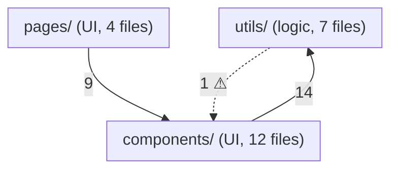

# Architecture Map

Turn the semantic-skeletonizer MCP graph into a readable Mermaid diagram plus
a layering analysis. The goal is a diagram a human can actually read — not a
hairball.

## Getting the data

Read the MCP resource `skeleton://project/global` from the
`semantic-skeletonizer` server. Use per-file `dependencies` for edges and
`symbols` kinds to characterize each file.

## Building the diagram

1. **Cluster by directory** (`src/components`, `src/utils`, ...). For repos
   over ~25 files, draw *directory-level* nodes and aggregate edges between
   them (label with edge count); only expand a directory into individual
   files if the user asks or the repo is small.
2. **Characterize clusters** by dominant symbol kind: mostly `component` →
   UI; mostly `interface`/`type` → types; mostly `function` → logic. Reflect
   it in the label, e.g. `components/ (UI, 12 files)`.
3. **Drop noise:** omit edges to pure type modules if they'd dominate (say
   you did); never draw `external_deps` as nodes unless asked — list top
   packages in a side note instead.
4. Emit `graph TD` Mermaid in a fenced block. Sanitize node ids
   (alphanumerics + underscores); put paths in the display label.

## Layering analysis

1. Infer the intended layer order from directory names, top (most
   dependent) to bottom (most depended-on). Typical:
   `pages/routes → components/features → hooks → services/utils → types`.
   Confirm the inference against the actual aggregate edge directions —
   whichever order makes the most edges point downward is "intended".
2. Every edge pointing *upward* against that order is a violation. Draw it
   dashed with a ⚠ label, and list each one with the importing file and the
   symbols pulled in (`import_records.names`).
3. State the layering health in one line: "212 edges, 3 upward (98.6% clean)".

## Output

Mermaid block first, then the violations list, then the external-packages
side note. If the user wants a file, write `ARCHITECTURE.md` containing the
diagram plus one sentence per cluster describing its role (derive from symbol
names, don't guess wildly).

## Caveats

- Mermaid over ~40 nodes is unreadable — aggregate harder rather than
  emitting more nodes, and say what was collapsed.
- Directory layout may not express intent (flat `src/`); if no layering is
  inferable, skip the violation analysis and say why.
