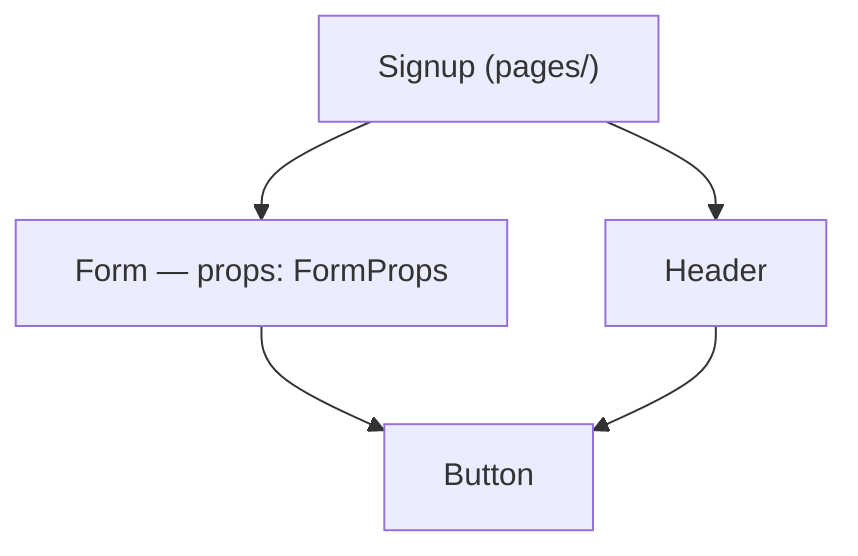

# Component Inventory

List every React component the semantic-skeletonizer detected, its props
shape, and how components compose each other.

## Getting the data

Read the MCP resource `skeleton://project/global` from the
`semantic-skeletonizer` server. Components are symbols with
`kind: "component"` (detected in `.tsx` files by PascalCase name or
`React.FC`/`FC` annotation). Props interfaces live in the same file's
`symbols` (kind `interface`/`type`) — match by the component signature's
parameter annotation (e.g. `({ onSubmit }: FormProps)` → `FormProps`).

## Building the inventory

Per component record: name, file, exported, props type name + its one-line
signature (the full shape is in the interface's `signature` field), and
whether it's a page/route (file under `pages/`, `app/`, `routes/`).

## Component hierarchy

File-level edges approximate the render tree: if `Page.tsx` imports
`Form.tsx` and both export components, draw `Page → Form`. Restrict to
component-exporting files so utils don't pollute the tree, and label
the edge with the imported component names from `import_records.names`.



## Report format

```
## Component inventory — 14 components in 11 files

| component | props | file | used by |
|---|---|---|---|
| Form | FormProps { onSubmit: (data: UserData) => void } | components/Form.tsx | Signup, Login |
| Button | ButtonProps { label, onClick } | components/Button.tsx | 6 components |
```

Then the Mermaid tree, then observations worth making:
- **Leaf/shared components** (high fan-in): the de-facto design system.
- **Unused components**: exported, never imported by another component file
  (cross-check framework routing conventions before calling them dead).
- **Props smells**: props interfaces with very many fields (read the
  signature), or components whose file also exports lots of non-UI symbols.

## Caveats

- Detection is heuristic: PascalCase functions in `.tsx` count as
  components; a PascalCase factory function can slip in.
- Import edges ≠ guaranteed render — a component imported for types or
  re-export isn't necessarily rendered. Say "composition (import-level)".
- `.ts` files never yield `component` kind, so components in `.ts` (rare,
  `React.createElement`-style) are missed.
